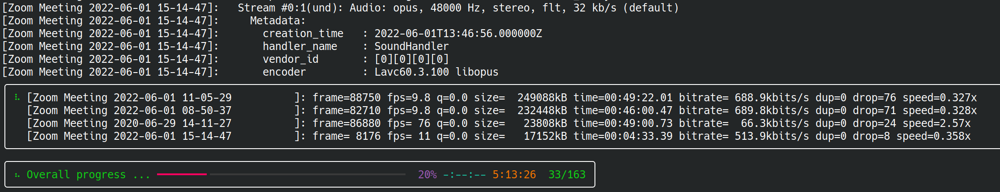

 # Batch Reencode

[](https://opensource.org/licenses/Apache-2.0)
[](https://opensource.org/licenses/MIT)


> “Let us save what remains: not by vaults and locks which fence them from the public eye and use in consigning them to the waste of time, but by such a multiplication of copies, as shall place them beyond the reach of accident.”\
> — Thomas Jefferson

## Overview


_The video being encoded at 76 fps and 66kbps bitrate is slides-only. The videos at 10 fps and 689 kbps include people's heads._

- What if you were in lockdown and every meeting or course was over video?
- What if you recorded them to ensure that the wealth of information delivered at high-speed can be rewatched later to dispel confusion?
- What if you used the only available tool on your computer at the time, say the built-in "Xbox Game Bar" on Windows 10?
- What if said tool recorded in lossless mode and a two-hour recording took about 8.7 GiB (at 10Mb/s bitrate)?

This script batch reencode videos produced by the Xbox Game Bar (tagged "performer: Microsoft Game DVR" in the file metadata) to significantly reduce their size while preserving good quality for long-term archival purposes.

It uses the following state-of-the-art codecs (encoder-decoder format):
- AV1 for video, which significantly outperforms H.264 and H.265, especially in slideshow / presentation of mostly static content
- Opus for audio, tuned for VoIP

Both codecs allow encoding a 1080p slideshow originally at 10.7Mb/s to about 64kbps, a factor 167x (32kbps video, 32 kbps audio) while retaining good quality, in particular not smearing details on figures or text.

The script itself is quality-adaptative and if higher bitrate is needed (say a video is played as part of the course)
it will adapt the size.

### Low-level details

The encoder configuration is:

```bash
ffmpeg -i <input.mp4> \
       -c:v libaom-av1 \
       -usage realtime -crf 32 -lag-in-frames 32 \
       -aom-params cpu-used=5:row-mt=1:tune-content=screen:deltaq-mode=0:enable-chroma-deltaq=1:enable-qm=1:quant-b-adapt=1:sharpness=3:arnr-strength=1:arnr-maxframes=4:disable-trellis-quant=0 \
       -c:a libopus -application voip -b:a 32k \
       -metadata title=<input> -metadata artist= \
       -y <output.webm>
```

_We use an empty artist metadata to drop_ Microsoft Game DVR.

Unfortunately most AV1 encoders do not use cores efficiently, many encoding tools resort to scene detection to split a video in different scene and distribute the scenes on multiple cores.

In our case, this is unnecessary overhead, slideshow presentations have very simple scenes, the concern is on encoding speed as AV1 is a notoriously slow codec. Hence instead of splitting a video, we can instead maximize throughput by encoding multiple at the same time. Empirical evidence show that allocating 3 cores per video offers the best tradeoff of utilization vs oversubscription.

To this end:
- we use asyncio with a semaphore to control resource utilization
- we use rich nested Live displays:
  - to report the statuses of each ffmpeg instances
  - to report overall progression

## Installation

This script is intended for personal usage and also showcasing advanced use of Python.
There is no plan to make it a full-fledged Python package. So copy it and run it:

- The current directory and subdirectory will be scanned for videos matching ".mp4"
  and produced by the "Xbox Game Bar". Adapt the filtering parameters if needed.
- A log file will be created in the working directory describing the encoding start and success.
- A reencoded file will be renamed "foo.mp4" to "foo.mp4.reencoded".
- Deletion is left at the user discretion.

## Dependencies

The script requires:

1. FFMPEG library, compiled with libaom (AV1 codec) and libopus.
2. PyMediaInfo, to access video metadata
3. Rich, to report statuses and progress
4. An Unix operating system (Mac or Linux), only in case of an error, the script uses a termination signal to kill all the child ffmpeg process that wasn't tested on Windows (but do work in Windows system for Linux)

### Disclaimer

No warranties whatsoever, this may eat your data. Have a backup.

## License

Licensed and distributed under either of

* MIT license: [LICENSE-MIT](LICENSE-MIT) or http://opensource.org/licenses/MIT

or

* Apache License, Version 2.0, ([LICENSE-APACHEv2](LICENSE-APACHEv2) or http://www.apache.org/licenses/LICENSE-2.0)

at your option. This file may not be copied, modified, or distributed except according to those terms.
